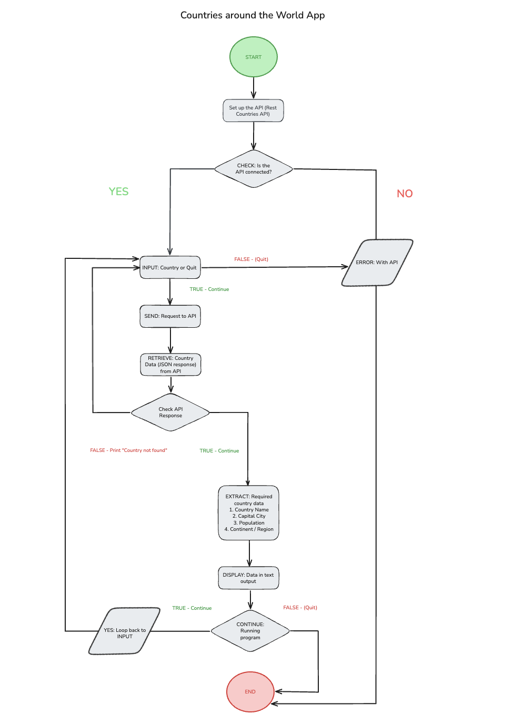
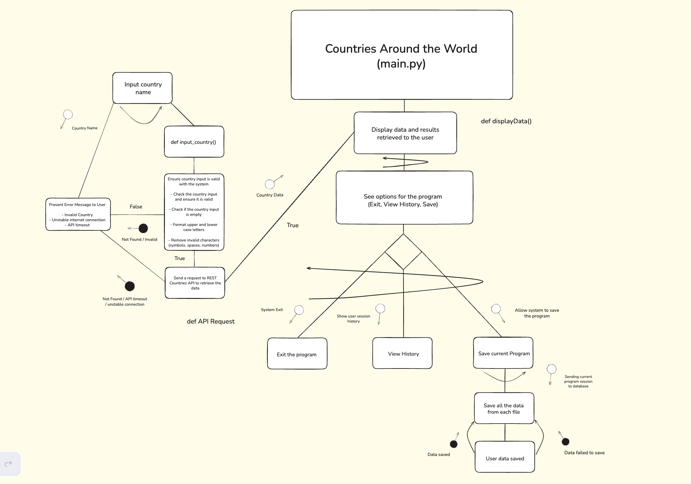
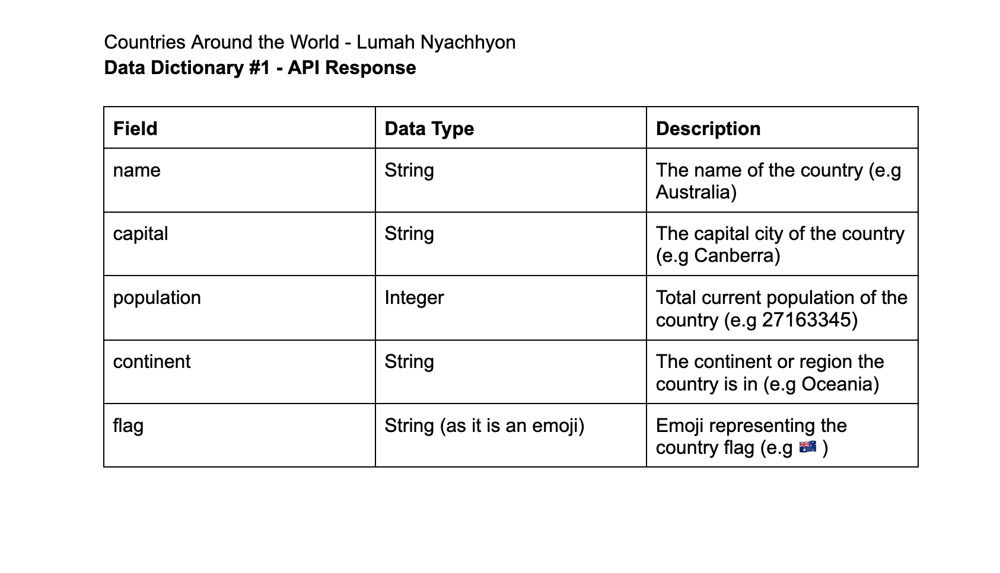
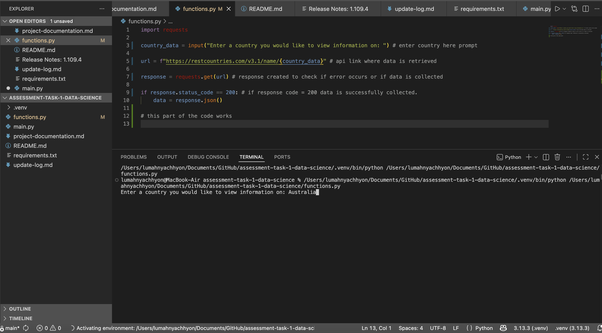

# Assessment Task 1 Documentation

## Requirements Definition:
### Functional and Non-Functional Requirements:

### Functional Requirements: (What the system should do):
**Data Retrieval:** What the user should be able to view throughout the program?

The user needs to be able to view the data they requested from the API, in this case, specific data on the country they inputted. Additionally, the user must also see error messages if a problem in the file occurs and helpful information directing the user to use the program correctly.

**User Interface:** What is required for the user to be able to properly interact with the system?

The system should embody the text the user inputs which contains the country which they want to view information on.
(Maybe) the program should display the country's flag along with the population, capital city, and region/continent.

**Data Display:** What information needs to be obtained from the system that the user needs?

The user needs to see clear and straightforward information displaying the data they requested, in this case, the program needs to produce the country's data which includes a clarified:

- Structured Menu System.
- Information Prompt.
- Instructions to help the user if they require.
- Error Message if program fails.
- Safe exit of the program when runtime complete.

- Country Information Data, including:
    - Population.
    - Capital city.
    - Region/continent where the country is located.

### Non Functional Requirements: (How the system should work):

**Performance:** How well should the system perform?

The system should perform systematically and swiftly to avoid any errors, breaks or delays in the program. To meet this criteria, the system must achieve:

- Respond to user input with data efficiently.
    - This means recieving and sending data back to the user in approximately two to three seconds or less.
- Able to process API requests methodically.
    - No crashes, breaks or delays.
- If an error arises, the system should recover smoothly or timeout and the program must be run again. 

**Reliability:** How reliable should the system as well as the data be?

Both the system and data need to be completely reliable in order for the program to run correctly, providing correct results each interaction with the user. The system must:

- Provide accurate and reliable data at all times whenever the user interacts with the system.
- Information must be consistent and the overall program should maintain dependable actions.
- Provide a strong connection with API requests to ensure no issues arise that could interfere with reliability (for example, system crashes).
- Prevent losing any data the user inputs or data recieved from the API during program runtime.

**Usability and Accessibility:** How reliable and usable should the system and data be?

In order to assist a large variety of different users with different needs and technical skills, the system must be easily comprehensible and simple to operate. The system should include:

- Include detailed help explanations to provide straightforward navigation.
- Easy to access error messages whenever a problem in the program occurs so the user can view and understand the fault.
- Effortless input instructions for the user to recognise how the system works.
- If no flaws take place and project runs correctly a legible output should be included.

## Determining Specifications:

**Verifying with Use Cases:**

#### **Use Case #1: Obtaining data from the API (in this case, REST Countries API)**

**Actor:** The user using the system to request the data.
**Preconditions:** None, no API key required as it is a Free to Use API. (Only requirement may be stable Internet)

1. Input the country into the system.

*The user inputs a country name into the prompt. (for example Japan.)*

2. Retrieving API data.

*The system collects the input and sends it to the API (REST Countries API) to recieve the data.*

3. Handling the API data.

*The system will scan if the data was retrieved from the API or if there was an error, if an error is returned an error number will be printed otherwise country data returned to the system in JSON format.*

**Postconditions:** 
- Either the system will retrieve the country data from the API smoothly.
- If an error occurs (e.g country not found) a message is sent to the user.
- The system stays running without breaking.

#### **Use Case #2: Displaying data to the user.** 
**Actor:** The user running the program.
**Preconditions:** The data that is successfully retrieved from the API.

1. Load the new data.

*The system stores the retrieved JSON data in a data dictionary.*

2. Filter the data recieved.

*The system will only extract the relevant information which includes:*
- Name of country.
- Capital city of the country.
- Population of people in the county.
- Region / Continent where the country is located.

3. Display the data to the user

*The system presents the data retrieved from the API (REST Countries API) in a readable format to the user. (Printed text for simplicity.)*

**Postconditions:** 
- Clean, filtered and relevant country data / information is displayed to the user.
- Any unecessary data that is retrieved from the API is removed.
- The system stays running without breaking. Maintains its responsiveness.

This program does not require a lot of tools to be able to perform properly, all that is needed is: a working device with a stable Internet Connection, most recent Python (3.11 and up), the latest version of GitHub, and requirements installed (requests and other libraries in requirements.txt)

## Design:

### Flowchart:

**Link** (Recommended:) https://excalidraw.com/#json=uCRXnnvVKywJIzsHfzxUX,eNwI2NfqdZ_zfUtiiwB-iQ

### Structure Chart:

### Gantt Chart:

### Data Dictionaries:

## Testing and Debugging:

**Testing functions.py file (early stage:)**

**First finished attempt: There were numerous bugs and issues with my code.****

## Maintenence:
